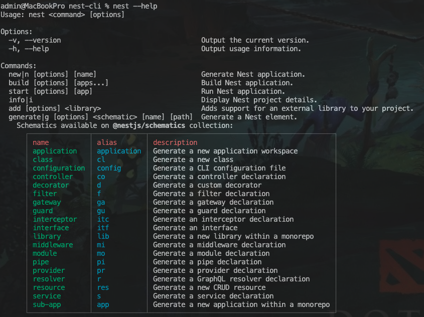

## nestjs

### cli常用指令

1. 创建新项目 

   ```apl
   nest new <项目名称>
   ```

2. 查看所有指令

   ```apl
   nest --help
   ```

​	 

3. 命令模板

   ```apl
   // 生成如上图中列出的各种模块，带test测试文件
   nest generator|g [options] [name] 
   // 生成如上图中列出的各种模块，不带test测试文件
   nest generator|g [options] [name] --no-spec
   
   // eg:生成一个user模块
   nest g mo user --no-spec
   // eg:生成一个user的service
   nest g s user --no-spec
   // eg:生成一个user的controller
   nest g co --co-spec
   ....
   ```

   

