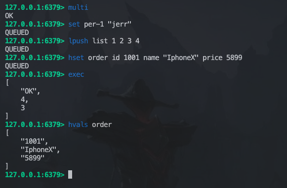

# Redis 

Redis（Remote Dictionary Server）是一个开源的内存数据结构存储系统，它提供了一个高效的键值存储解决方案，并支持多种数据结构，如字符串（Strings）、哈希（Hashes）、列表（Lists）、集合（Sets）和有序集合（Sorted Sets）等。它被广泛应用于缓存、消息队列、实时统计等场景。

## 一、常用指令

#### 1、 基本类型value

```cmake
/*
key：要设置的键名
value：要设置的值
NX：可选参数，表示只在键不存在时才设置值。
XX：可选参数，表示只在键已经存在时才设置值。
EX seconds：可选参数，将键的过期时间设置为指定的秒数。
PX milliseconds：可选参数，将键的过期时间设置为指定的毫秒数。
GET：可选参数，返回键的旧值。
*/

SET key value [NX|XX] [EX seconds] [PX milliseconds] [GET]

// 1、设置name:Echo
SET name "Echo"
// 2、设置"count" 值为 100，并设置过期时间 30s
SET count 100 EX 30
// 3、只在键名为 "status" 不存在时，设置其值为 "active"
SET status "active" NX
// 4、只在键名为 "score" 已经存在时，将其值设置为 5
SET score 5 XX
// 5、设置键名为 "message" 的值为 "Hello"，并返回旧的值
SET message "Hello" GET
// 6、删除键名为 "name" 的键：
DEL name
// 7、批量删除多个键名
DEL key1 key2 key3
// 删除成功返回1，失败返回0
// 补充：删除不存在的键名，不会报错，返回删除的键数量为 0：

  
```

#### 2、集合操作

集合（Set）是一种无序且不重复的数据结构，用于存储一组独立的元素。集合中的元素之间没有明确的顺序关系，每个元素在集合中只能出现一次。

``` cmake
// 添加成员到集合
SADD key member [member...]

SADD fruit "apple" "banana" "orange"

// 获取集合中的所有成员
SMEMBERS fruit

// 检查成员是否存在于集合中:返回	1	|	0
SISMEMBER fruit "apple"

// 从集合中移除成员:返回	1	|	0
SREM fruit "orange"

// 获取集合中的成员数量
SCARD fruit

// 获取随机成员
SRANDMEMBER fruit

// 获取多个集合的并集
SADD users "jack" "echo"
SUNION users fruit

// 获取多个集合的交集
SADD students "echo" "Bob"
SINTER users students

// 获取一个集合相对于另一个集合的差集
SDIFF users students
["jack"]
sdiff students users
["Bob"]

```

#### 3、Hash表{}操作

哈希表（Hash）是一种数据结构，也称为字典、关联数组或映射，用于存储键值对集合。在哈希表中，键和值都是存储的数据项，并通过哈希函数将键映射到特定的存储位置，从而实现快速的数据访问和查找。

```cmake
// 设置哈希表中的字段值
HMSET obj name "John" age 25 email "john@example.com"

// 获取哈希表中的字段值
HGET obj name

// 获取多个字段
HMGET obj name age
["John","25"]

// 获取哈希表中所有字段的值
HGETALL obj
["name","John","age","25","email","john@example.com"]

// 删除哈希表中的字段(会返回删除了多少个，删除没有的字段不计数)
HDEL obj age email

// 获取哈希表中所有的值
hset obj age 33 emial "echo@gmail.com"
HVALS obj
["John","33","echo@gmail.com"]

//获取哈希表中所有字段的数量
HLEN obj
```

#### 4、列表的操作

```cmake
// 添加元素
RPUSH key element1 element2 element3  // 将元素从右侧插入列表
LPUSH key element1 element2 element3  // 将元素从左侧插入列表

// 获取元素
LINDEX key index  // 获取列表中指定索引位置的元素
LRANGE key start stop  // 获取列表中指定范围内的元素

// 修改元素
LSET key index newValue  // 修改列表中指定索引位置的元素的值

// 删除元素
LPOP key  // 从列表的左侧移除并返回第一个元素
RPOP key  // 从列表的右侧移除并返回最后一个元素
LREM key count value  // 从列表中删除指定数量的指定值元素

// 获取列表长度
LLEN key
```


## 二、发布-订阅

发布-订阅是一种消息传递模式，其中消息发布者（发布者）将消息发送到频道（channel），而订阅者（订阅者）可以订阅一个或多个频道以接收消息。这种模式允许消息的解耦，发布者和订阅者之间可以独立操作，不需要直接交互。

在Redis中，发布-订阅模式通过以下命令进行操作：

1. PUBLISH命令：用于将消息发布到指定的频道。语法为：PUBLISH channel message。

   例如，`PUBLISH news "Hello, world!"` 将消息"Hello, world!"发布到名为"news"的频道。

2. SUBSCRIBE命令：用于订阅一个或多个频道。语法为：SUBSCRIBE channel [channel ...]。

   例如，SUBSCRIBE news sports 订阅了名为"news"和"sports"的频道。

3. UNSUBSCRIBE命令：用于取消订阅一个或多个频道。语法为：UNSUBSCRIBE [channel [channel ...]]。

   例如，UNSUBSCRIBE news 取消订阅名为"news"的频道。

4. PSUBSCRIBE命令：用于模式订阅一个或多个匹配的频道。语法为：PSUBSCRIBE pattern [pattern ...]。其中，pattern可以包含通配符。

   例如，PSUBSCRIBE news.* 订阅了以"news."开头的所有频道。

5. PUNSUBSCRIBE命令：用于取消模式订阅一个或多个匹配的频道。语法为：PUNSUBSCRIBE [pattern [pattern ...]]。

   例如，PUNSUBSCRIBE news.* 取消订阅以"news."开头的所有频道。

## 三、事务

Redis支持事务（Transaction），它允许用户将多个命令打包在一起作为一个单元进行执行。事务提供了一种原子性操作的机制，要么所有的命令都执行成功，要么所有的命令都不执行。

Redis的事务使用MULTI、EXEC、WATCH和DISCARD等命令来管理。

1. MULTI命令：用于开启一个事务。在执行MULTI命令后，Redis会将接下来的命令都添加到事务队列中，而不是立即执行。
2. EXEC命令：用于执行事务中的所有命令。当执行EXEC命令时，Redis会按照事务队列中的顺序执行所有的命令。执行结果以数组的形式返回给客户端。
3. WATCH命令：用于对一个或多个键进行监视。如果在事务执行之前，被监视的键被修改了，事务将被中断，不会执行。
4. DISCARD命令：用于取消事务。当执行DISCARD命令时，所有在事务队列中的命令都会被清空，事务被取消。

使用事务的基本流程如下：

1. 使用MULTI命令开启一个事务。
2. 将需要执行的命令添加到事务队列中。
3. 如果需要，使用WATCH命令监视键。
4. 执行EXEC命令执行事务。Redis会按照队列中的顺序执行命令，并返回执行结果。
5. 根据返回结果判断事务执行是否成功。

事务中的命令在执行之前不会立即执行，而是在执行EXEC命令时才会被执行。这意味着事务期间的命令并不会阻塞其他客户端的操作，也不会中断其他客户端对键的读写操作。

需要注意的是，`Redis的事务不支持回滚操作`。如果在事务执行期间发生错误，事务会继续执行，而不会回滚已执行的命令。因此，在使用Redis事务时，需要保证事务中的命令是幂等的，即多次执行命令的结果和一次执行的结果相同

 

## 四、持久化

### redis持久化

Redis提供两种持久化方式：

1. RDB（Redis Database）持久化：RDB是一种快照的形式，它会将内存中的数据定期保存到磁盘上。可以通过配置Redis服务器，设置自动触发RDB快照的条件，比如在指定的时间间隔内，或者在指定的写操作次数达到一定阈值时进行快照保存。RDB持久化生成的快照文件是一个二进制文件，包含了Redis数据的完整状态。在恢复数据时，可以通过加载快照文件将数据重新加载到内存中。
2. AOF（Append-Only File）持久化：AOF持久化记录了Redis服务器执行的所有写操作命令，在文件中以追加的方式保存。当Redis需要重启时，可以重新执行AOF文件中保存的命令，以重新构建数据集。相比于RDB持久化，AOF持久化提供了更好的数据恢复保证，因为它记录了每个写操作，而不是快照的形式。然而，AOF文件相对于RDB文件更大，恢复数据的速度可能会比较慢。

### RDB使用

打开redis配置文件

 

找到save

 

他提供了三个案例

1. 3600秒内也就是一小时进行一次改动就会触发快照
2. 300秒内也就是5分钟，进行100次修改就会进行快照
3. 60秒内一万次修改就会进行快照

具体场景根据用户量，以及负载情况定义.

 

其次就是可以通过命令行手动触发`save`快照

 

### AOF使用

将 `appendonly` 配置项的值设置为 `yes`：默认情况下，该配置项的值为 `no`，表示未启用AOF持久化。将其值修改为 `yes`，以启用AOF持久化。

 

补充：由于操作系统mac和window不同、redis启动方式不同（官方下载本地、docker镜像运行）等原因。具体配置步骤可借助AI辅助完成

## 五、主从复制

Redis主从复制是一种数据复制和同步机制，其中一个Redis服务器（称为主服务器）将其数据复制到一个或多个其他Redis服务器（称为从服务器）。主从复制提供了数据冗余备份、读写分离和故障恢复等功能。

 

以下是Redis主从复制的一般工作流程：

1. 配置主服务器：在主服务器上，你需要在配置文件中启用主从复制并指定从服务器的IP地址和端口号。你可以使用`replicaof`配置选项或`slaveof`配置选项来指定从服务器。
2. 连接从服务器：从服务器连接到主服务器并发送复制请求。从服务器通过发送`SYNC`命令请求进行全量复制或通过发送`PSYNC`命令请求进行部分复制（增量复制）。
3. 全量复制（SYNC）：如果从服务器是第一次连接或无法执行部分复制，主服务器将执行全量复制。在全量复制期间，主服务器将快照文件（RDB文件）发送给从服务器，从服务器将接收并加载该文件以完全复制主服务器的数据。
4. 部分复制（PSYNC）：如果从服务器已经执行过全量复制并建立了复制断点，主服务器将执行部分复制。在部分复制期间，主服务器将发送增量复制流（replication stream）给从服务器，从服务器将接收并应用该流以保持与主服务器的同步。
5. 复制持久化：从服务器接收到数据后，会将其保存在本地磁盘上，以便在重启后仍然保持数据的一致性。
6. 同步延迟：从服务器的复制是异步的，因此存在复制延迟。延迟取决于网络延迟、主服务器的负载和从服务器的性能等因素。
7. 读写分离：一旦建立了主从复制关系，从服务器可以接收读操作。这使得可以将读流量从主服务器分散到从服务器上，从而减轻主服务器的负载。
8. 故障恢复：如果主服务器发生故障，可以将一个从服务器提升为新的主服务器，以继续提供服务。当主服务器恢复时，它可以作为从服务器连接到新的主服务器，继续进行数据复制。


## **六、ioredis**

ioredis 是一个强大且流行的 Node.js 库，用于与 Redis 进行交互。Redis 是一个开源的内存数据结构存储系统。ioredis 提供了一个简单高效的 API，供 Node.js 应用程序与 Redis 服务器进行通信。

以下是 ioredis 的一些主要特点：

1. 高性能：ioredis 设计为快速高效。它支持管道操作，可以在一次往返中发送多个 Redis 命令，从而减少网络延迟。它还支持连接池，并且可以在连接丢失时自动重新连接到 Redis 服务器。
2. Promises 和 async/await 支持：ioredis 使用 promises，并支持 async/await 语法，使得编写异步代码和处理 Redis 命令更加可读。
3. 集群和 sentinel 支持：ioredis 内置支持 Redis 集群和 Redis Sentinel，这是 Redis 的高级功能，用于分布式设置和高可用性。它提供了直观的 API，用于处理 Redis 集群和故障转移场景。
4. Lua 脚本：ioredis 允许你使用 `eval` 和 `evalsha` 命令在 Redis 服务器上执行 Lua 脚本。这个功能使得你可以在服务器端执行复杂操作，减少客户端与服务器之间的往返次数。
5. 发布/订阅和阻塞命令：ioredis 支持 Redis 的发布/订阅机制，允许你创建实时消息系统和事件驱动架构。它还提供了对 `BRPOP` 和 `BLPOP` 等阻塞命令的支持，允许你等待项目被推送到列表中并原子地弹出它们。
6. 流和管道：ioredis 支持 Redis 的流数据类型，允许你消费和生成数据流。它还提供了一种方便的方式将多个命令进行管道化，减少与服务器之间的往返次数。
